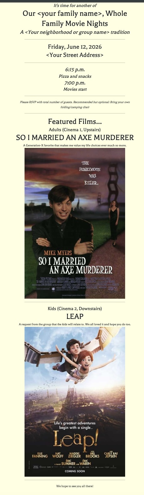

# invite-maker

Have you ever wanted a nice party invitation, but you don't like a lot of online solutions that have advertisements, automatically prompt your guests to buy gifts, or require a subscription to avoid all that?  

I wanted a fun project for creating movie-night party invitations, since I host them three times a year, so I created this site builder to do just that.

I needed:

* Something that looked good on mobile and desktop.
* Something that could be made into a single image/screenshot easily
* Something that could also render everything as plain text.
* Something easily customizable

This is what I came up with.

Uses `bun`, but `npm` should also work.  Build with Node v22.



## Setup


`bun install`

edit `invitedata/date-time.json` and `invitedata/general.json` as needed.

You can also add/edit the images and film data in `filmdata`

`bun list_films`


(output...)

```
Title                                         Key
-------------------------------------------------------
AKEELAH AND THE BEE                           akeelah
ANCHORMAN                                     anchorman
SO I MARRIED AN AXE MURDERER                  axe
THE 'BURBS                                    burbs
HONEY, I SHRUNK THE KIDS                      shrunk
....contents of filmdata directory
```

(Choose two films)
```bash
bun run prep_resources film1 film2

e.g.

bun run prep_resources burbs shrunk
```

`prep_resources` will copy image and text resources to a target directory and generate a preview image
suitable for mobile url previews as well as the TV banner image.  It will also update index.html metadata.

To run: `bun run dev` or `bun run build`

See `bun run deploy` to post to a public website via scp and ssh


## Other options

1. Run `bun run make_text` to generate an optional plain text summary and small 
preview image.
2. Run `bun run screenshot` to create an image of the static site (site must be running locally already)


## Endpoints

`invite/` -- The main page

`invite/#/side` -- Shows a side-by side version of the invitation, better for some screens or screenshots.

`invite/#/banner` -- Shows a simplified widescreen page suitable for showing on a TV.
The project compiles to older Ecmascript standards, as most TVs don't support a lot of modern HTML/JS.

