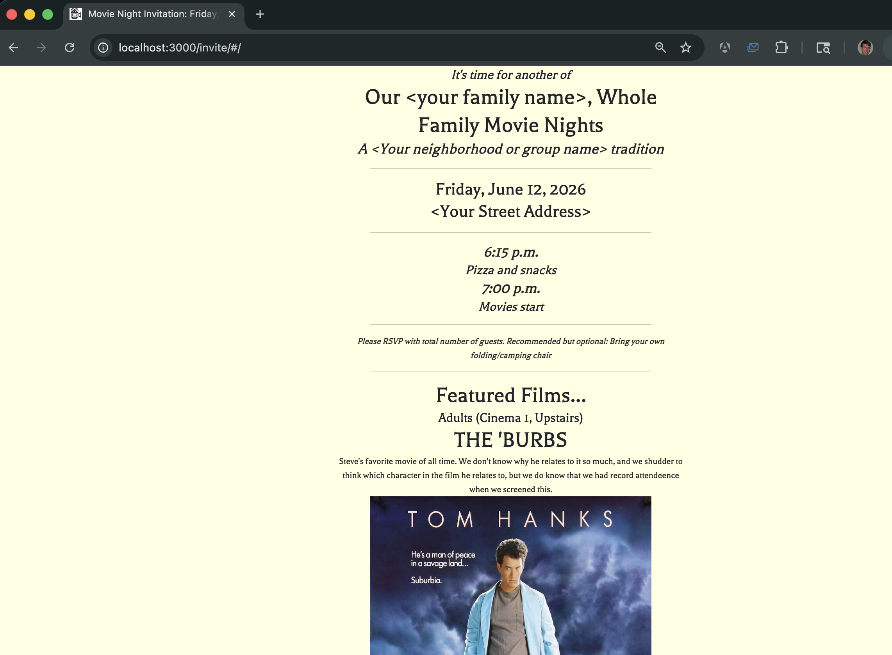

# invite-maker

A SolidJS + Vite app for generating movie night invitations, served at `/invite/`. Content is driven by JSON data files in `src/res/` and `res/`, making it easy to swap films and dates without touching code.




## Project structure

- `src/res/general.json` — static strings (title, address, food, rsvp, etc.)
- `src/res/date-time.json` — event date and showtimes
- `src/res/film1.json` / `film2.json` — the two active films (point to entries in `res/`)
- `res/*.json` — library of all available films
- `public/` — static assets (poster images, preview.png)

## Setup

```bash

bun install

edit invitedata/date-time.json and invitedata/general.json as needed.

You can also add/edit the images and film data in filmdata

bun list_films

(output...)
Title                                         Key
-------------------------------------------------------
AKEELAH AND THE BEE                           akeelah
ANCHORMAN                                     anchorman
SO I MARRIED AN AXE MURDERER                  axe
....contents of filmdata directory

```
(Choose two films)
```bash
./prep_resources.sh film1 film2

e.g.

./prep_resources.sh burbs shrunk
```

`prep_resources.sh` will copy image and text resources to the build directory and generate a preview image
suitable for mobile url previews as well as the TV banner image.  It will also update index.html metadata.

To run: `bun run dev` or `bun run build`


## Other options

1. Run `bun run make_text` to generate an optional plain text summary and small 
preview image.
2. Run `bun run screenshot` to create an image of the static site (site must be running locally already)
3. Run `deploy.sh <filmkey1> <filmkey2>` to configure and post to website

