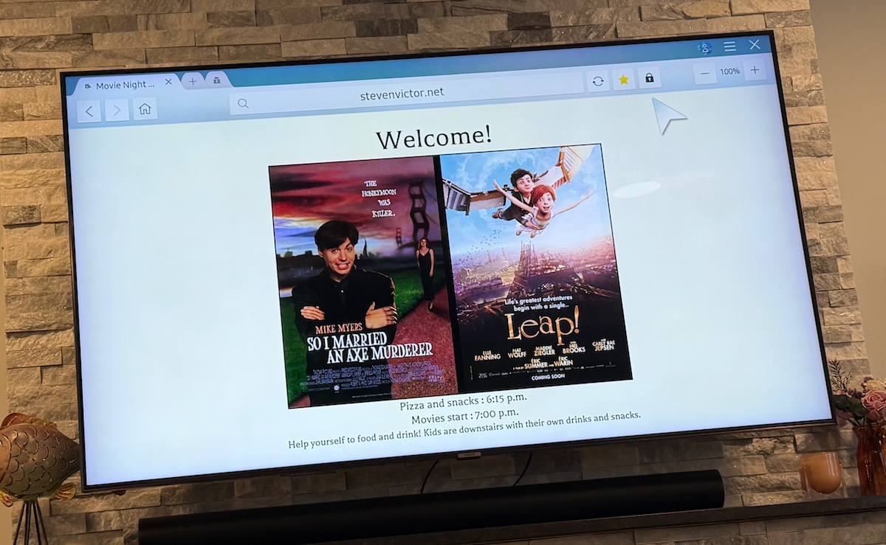
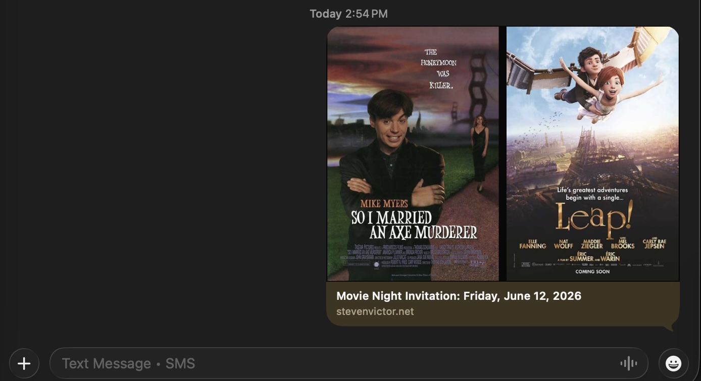

# invite-maker

v0.1

Copyright Steven Mycynek 2026

Have you ever wanted a nice party invitation, but you don't like a lot of online solutions that have advertisements, automatically prompt your guests to buy gifts, or require a subscription to avoid all that?  

I wanted a fun project for creating movie-night party invitations, since I host them three times a year, so I created this site builder to do just that.

I needed:
* Something that could build a static website to deploy to any host as well as generate image screenshots and plain text summaries.
* Something that could also render everything as plain text.
* Something that looked good on mobile and desktop.
* Something with easy customizable content

Basically, I wanted a way to render HTML to post to a URL, a single image with all info, or text
-- all from one data source and have preview images for text messages/social media as well.

This is what I came up with.

Rendered page


TV banner




Text message previews of the URL look great, too!



## Setup

Built with Node v24, SolidJS, and Vite

`npm install`

Edit `invitedata/date-time.json` and `invitedata/general.json` as needed.

Also see `fontandcolor.css` for other easy tweaks.

You can also add/edit the images and film data in the `filmdata` directory

`npm run list_films`

(output...)

```
Title                                         Key
-------------------------------------------------------
AKEELAH AND THE BEE                           akeelah
ANCHORMAN                                     anchorman
SO I MARRIED AN AXE MURDERER                  axe
THE 'BURBS                                    burbs
HONEY, I SHRUNK THE KIDS                      shrunk
....contents of filmdata directory
```

(Choose two films)
```bash
npm run prep_resources film1 film2

e.g.

npm run prep_resources burbs shrunk
```

`prep_resources` will copy image and text resources to a target directory and generate a preview image
suitable for mobile url previews as well as the TV banner image.  It will also update index.html metadata and build and deploy metadata, such as your website url and path from `general.json`

To run: `npm run dev` or `npm run build`

See `npm run deploy` to post to a public website via scp and ssh -- see `scripts/sitevars.sh`

This project is a bit of a Frankenstein, as some options are configured through high-level scripts, but other things are better left to actual code/css, such as font changes.  Also, the idea that you need to install node, npm, a screen-grab-library, and ssh/scp to make a party invitation is a little out there, but this is all just for fun.

## Other options

1. Run `npm run make_text` to generate an optional plain text summary and small 
preview image.
2. Run `npm run make_screenshot <standard | side | banner>` to create an image of the static site (site must be running locally already)


## Endpoints

`invite/` -- The main page

`invite/#/side` -- Shows a side-by side version of the invitation, better for some screens or screenshots.

`invite/#/banner` -- Shows a simplified widescreen page suitable for showing on a TV.

## Live demo
https://stevenvictor.net/invite/#/

The project compiles to older Ecmascript standards, as most TVs don't support a lot of modern HTML/JS.

